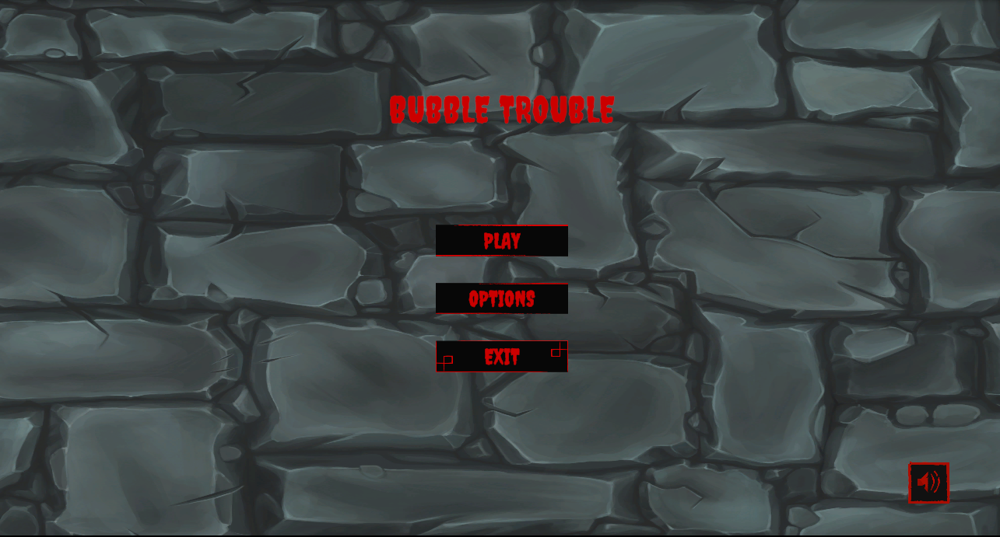
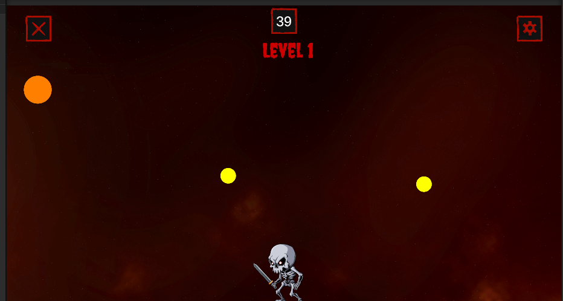
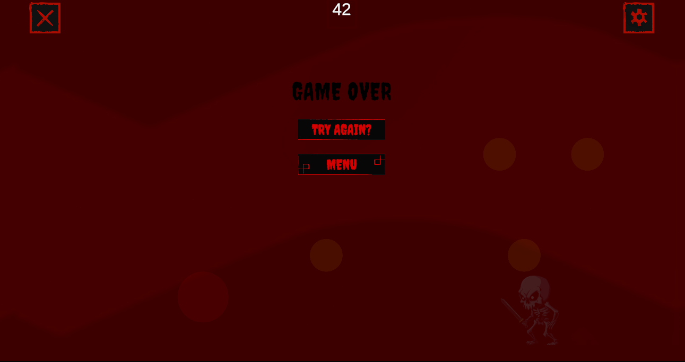
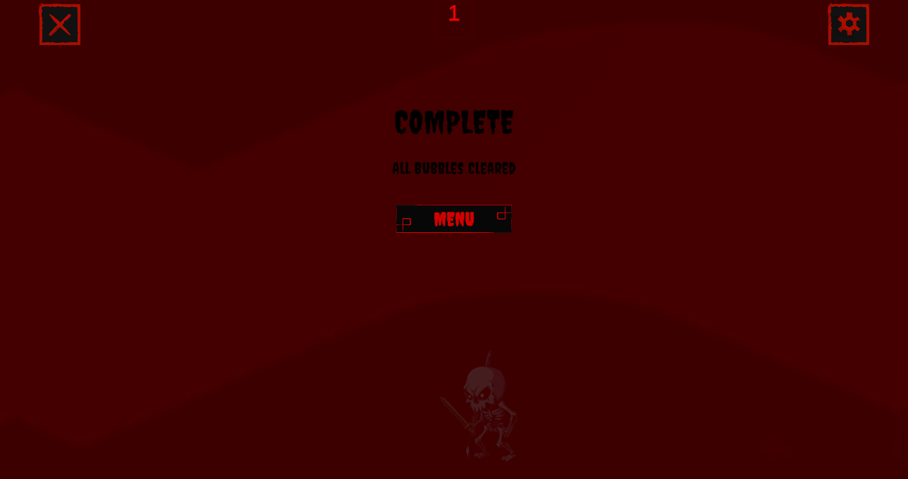

# Проектна задача по Визулено програмирање - Bubble Trouble.

За нашата проеткна задача, бевме инспирирани од оригиналната игра [Bubble Trouble](https://www.crazygames.com/game/bubble-trouble-cpy), во која ние ја имплементиравме во Unity. Целта на играта е играчот да ги уништи сите топки во нивото користејќи харпун, притоа избегнувајќи судир со нив. При погодок, поголемите топки се делат на две помали, што ја прави играта постепено потешка, се додека не станат многу мали и се уништат.
Ние ја имплементиравме играта така што играте како костур кој се бори да избега од подземниот свет, кој се бори против топчињата користејќи го својот меч.

Играта содржи:
 - Движење на играчот лево и десно.
 - Пукање со харпун (во наш случај, меч),
 - Физика на движење и одбивање на топките.
 - Делба на големите топки на помали.
 - Победа по уништување на сите топки.
 - Пораз доколку играчот е погоден од топче.
 - Повеќе нивоа


## Структура на податоците и главните класи
 - PlayerController
 - BubbleController
 - BulletController
 - GameController <br>

-Класата **PlayerController** раководи со движењето на играчот, пукање на мечовите и состојбата на играчот(дали бил погоден од топче). Користевме GameObject за претставување на играчот и RigidBody2D класата за движењето на играчот <br>

-Класата **BubbleController** е одговорна за движењето на топчињата (дали удриле ѕид или под), поделба на помали топчиња и уништување на тоа топче. Користиме енумерација за мерење на големината на топчето и float за брзината на топчето. <br>

-Класата **BulletController** работи со мечовите дали погодиле топче или пак промаршил (boolean).<br>

-**GameController**-от се занимава со дали играчот победил, изгубил, со тајмерот и со копчињата. Користевме GameManager што е веќе готова класа од Unity<br>

Исто така имаме некој помали класи како UIManager-от и AudioManager кој се занимават со изгледот и со звукот на играта. За менаџирање на нивоата и главното мени користевме __UnityScenes__.

### Bubble класата

Во BubbleController класата имаме повеќе важни фукнции, но и важни променливи: <br>
```c#
    public enum BubbleSize { Large, Medium, Small }
    public BubbleSize currentSize = BubbleSize.Large;
    private Rigidbody2D rb;
    private float horizontalSpeed;
    private float bounceForce;
```
__BubbleSize__ - енумерација за менаџирање со големината на топчето<br>
__currentSize__ - тип од енумерацијата BubbleSize, со која ќе раководиме со големината на топчето и чија почетна вредност ја ставаме на Large <br>
__rb__ - тип од RigidBody2D Unity класата<br>
__horizontalSpeed__ и __bounceForce__ - типови од float, со ќе ја пресметуваме брзината на топчињата при судир<br>
```c#
void OnCollisionEnter2D(Collision2D col)
{
    if (col.gameObject.CompareTag("Floor"))
    {
        rb.linearVelocity = new Vector2(rb.linearVelocity.x, bounceForce);
    }

    if (col.gameObject.CompareTag("Wall"))
    {
        float bounceDir = col.contacts[0].normal.x > 0 ? 1f : -1f;
        rb.linearVelocity = new Vector2(bounceDir * horizontalSpeed, rb.linearVelocity.y);
    }
}
```
Во оваа функциа имаме Collision2D објект `col` кој ќе ни каже со што топчето се судри во ѕид или со подот. Ако судирот е со подот, тогаш `rb.linearVelocity` го поставуваме оди во спротивната насока, а додека при судир со ѕид, преку `bounceDir` дознаваме кој во ѕид се судри топчето кој потоа го праќаме во спротивната насока.
```c#
public void ApplySize()
{
    switch (currentSize)
    {
        case BubbleSize.Large:
            transform.localScale = Vector3.one * 1.4f;
            horizontalSpeed = 2.5f;
            bounceForce = 16f;
            GetComponent<SpriteRenderer>().color = Color.red;
            break;

        case BubbleSize.Medium:
            transform.localScale = Vector3.one * 0.9f;
            horizontalSpeed = 3.5f;
            bounceForce = 14f;
            GetComponent<SpriteRenderer>().color = new Color(1f, 0.5f, 0f);
            break;

        case BubbleSize.Small:
            transform.localScale = Vector3.one * 0.5f;
            horizontalSpeed = 5f;
            bounceForce = 14f;
            GetComponent<SpriteRenderer>().color = new Color(1f, 1f, 0f);
            break;
    }
}
```
Во `ApplySize` функцијата имаме switch-case, каде ќе ја менуваме брзината и скотот на топчето. Колку поголемо топчето, толку е поспоро и неговиот скок е исто така поголем што го прави полесно за погодување. Оваа функција ја повикуваме кога ќе се појават нови топчиња.

```c#
void SpawnChildren(BubbleSize childSize)
{
    float childSpeed = childSize == BubbleSize.Medium ? 3.5f : 5f;
    float childBounce = childSize == BubbleSize.Medium ? 10f : 8f;

    GameObject prefabToSpawn = bubblePrefab != null ? bubblePrefab : gameObject;

    for (int i = 0; i < 2; i++)
    {
        float dir = (i == 0) ? -1f : 1f;
        Vector2 velocity = new Vector2(dir * childSpeed, childBounce);

        Vector3 spawnPos = transform.position + new Vector3(dir * 0.5f, 0f, 0f);

        GameObject child = Instantiate(prefabToSpawn, spawnPos, Quaternion.identity);
        child.GetComponent<BubbleController>().InitChild(childSize, prefabToSpawn, velocity);
    }
}
```
`SpawnChildren` функцијата во самото име се знае за што се користи. `float childSpeed = childSize == BubbleSize.Medium ? 3.5f : 5f;` и `float childBounce = childSize == BubbleSize.Medium ? 10f : 8f;`, прашуваме дали големината на топчето е Large или Мedium. Во циклусот случајно ја бираме насоката и преку вектор ја бираме брзината и локацијата каде ќе се појаваат топчињата. Потоа преку GameObject ги иницијализиаме топчињата и ќе се појават во игра.

###Контроли и правила
 - __A__ (движење на лево)
 - __D__ (движење на десно)
 - __Space__ (пукање мечови)

**Избегнувај ги топчињата или ќе изгубиш! <Br>
Со секој погодок големото топче се дели на две помали! <Br>
Уништете ги сите топки за да го завршите нивото!**

## Screenshots

### Main Menu



### Gameplay



### Game Over



### Game Win



## Изработиле

- Глигор Котески, 241139
- Коста Жиковски, 233262
- Лука Костоски, 242041
